[简体中文](./README_zh-CN.md) | English

# Dialog flow chat bot
**only ONE executable file**, you can use it directly, including intent detection, AI management, a visual process editor and a response system.  

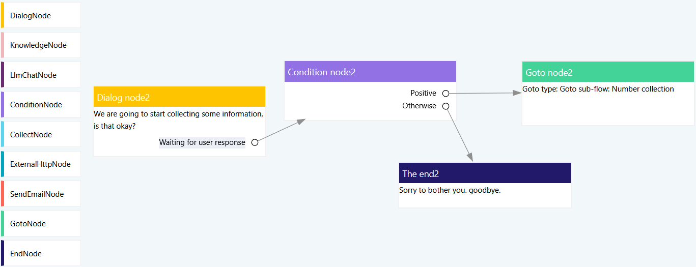

# ✨ Features
* 🛒 **Light** Only ONE executable file, it can run smoothly on laptops without GPUs (data files will be created at runtime automatically).
* 🐱‍🏍 **AI powered** Integrated `Huggingface local models (Llama, Phi-3, Gemma, Multilingual E5, MiniLM L6v2, NomicEmbedTextV1_5, etc.)`, `Ollama` and `OpenAI`, this can be used for `Chat`, `Text generation` and `Intent detection`.
* 🚀 **Fast** Built on Rust and Vue3.
* 😀 **Simple** Use the mouse to drag and drop with our intuitive node-based editor.
* 🔐 **Safe** 100% open source, all runtime data is saved locally (Using `OpenAI API` may expose some data).

# Give it a try!
* 🐋 **Docker** We provided an image on Docker Hub at [dialogflowchatbot/demo](https://hub.docker.com/repository/docker/dialogflowchatbot/demo)
* 💻 **Binary releases**, please check [here](https://github.com/dialogflowchatbot/dialogflow/releases)

> By default application will listen to `127.0.0.1:12715`, you can use `-ip` and `-port` specify new value, e.g.: `dialogflow -ip 0.0.0.0 -port 8888`

<!-- # Releases and source code
* 💾 If you're looking for **binary releases**, please check [here](https://github.com/dialogflowchatbot/dialogflow/releases)
* 🎈 The **back end** of this application is [here](https://github.com/dialogflowchatbot/dialogflow-backend)
* 🎨 The **front end** of this application is [here](https://github.com/dialogflowchatbot/dialogflow-frontend) -->

# Check out introduction page
[https://dialogflowchatbot.github.io/](https://dialogflowchatbot.github.io/#/)

# Function nodes
|Node|Name|
|----|----|
|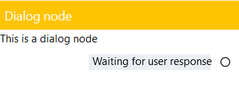|Dialog Node|
|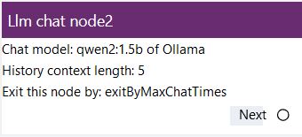|Large language model chat node|
|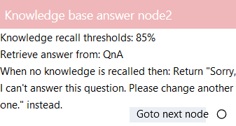|Knowledge base answer node|
|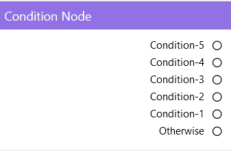|Conditions node|
|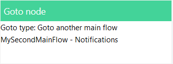|Goto node|
|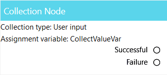|Collect node|
|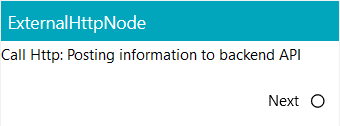|External HTTP node|
|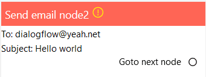|Send email node|
|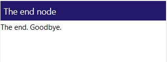|The end node|

Using the different nodes above, to arrange and combine, you can get a conversational bot that can handle problems in different scenarios.

# Screenshots
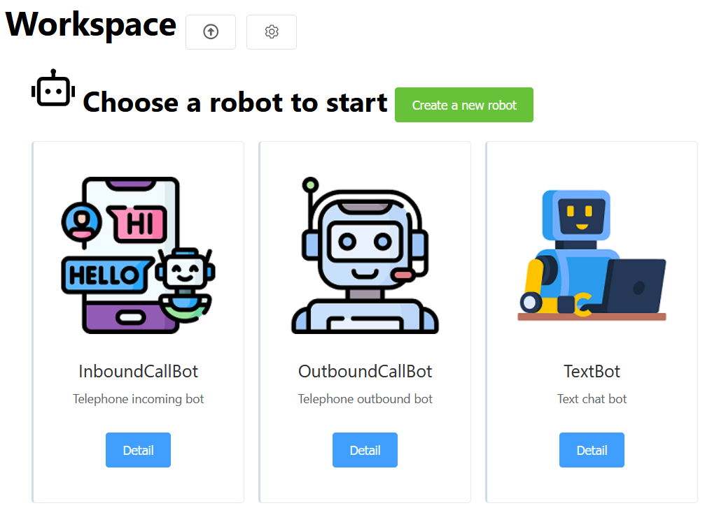

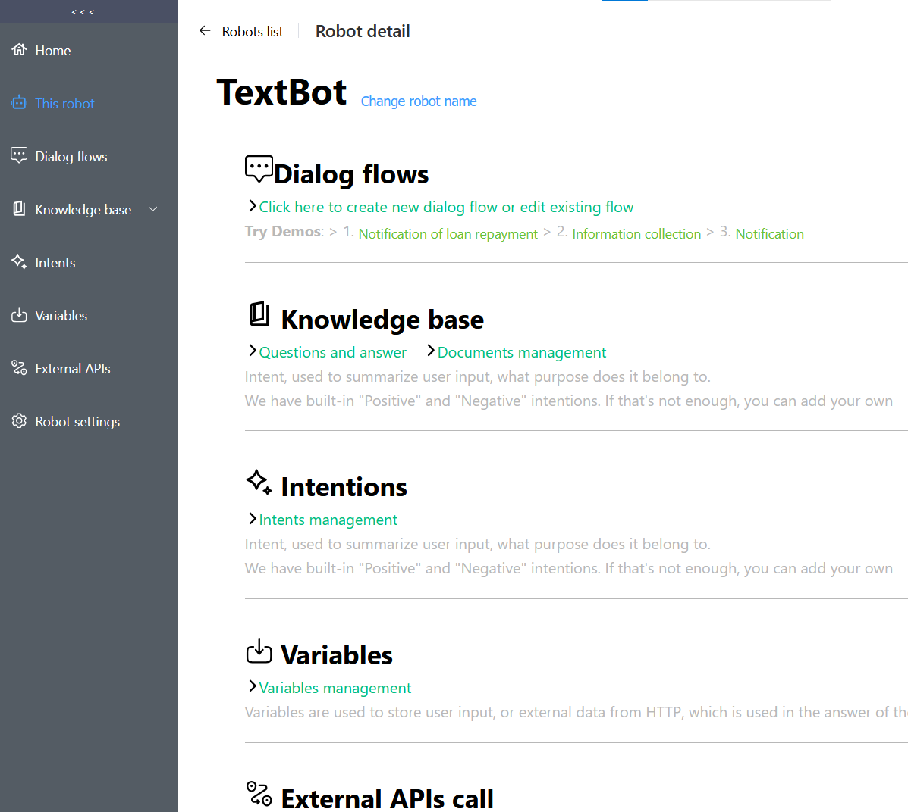

### Trying a demo dialog flow
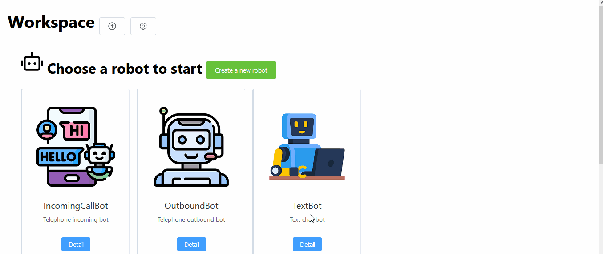

### Setup a condition branch
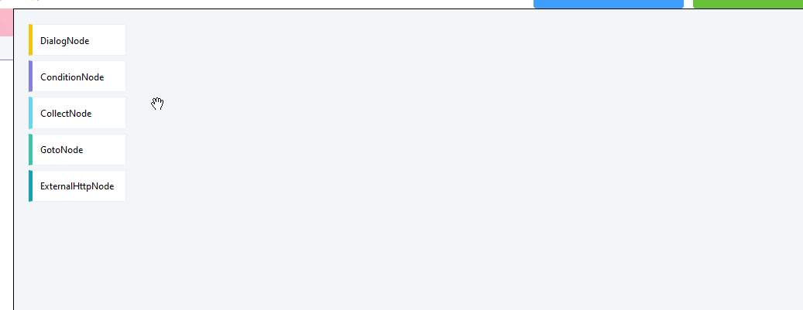

### Text generation

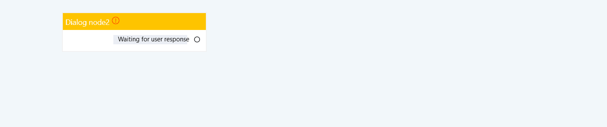

### Testing a dialog flow
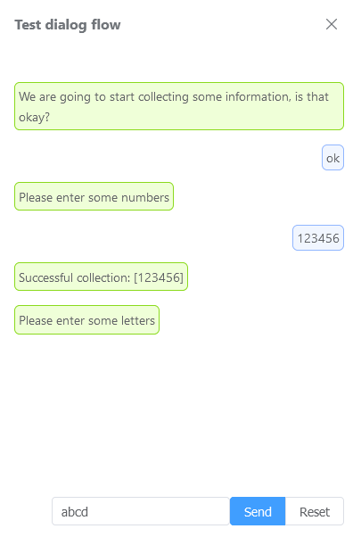

# Get started

### Docker image
1. docker pull dialogflowchatbot/demo
2. docker run -dp 127.0.0.1:12715:12715 --name dialogflowdemo dialogflowchatbot/demo
3. Open your browser and visit: http://127.0.0.1:12715/

### Binary release
1. From [Github release page](https://github.com/dialogflowchatbot/dialogflow/releases), depending on the operating system, download the application.
1. Run it directly, or use the `-ip` and `-port` parameters to perform the listening IP address and port, e.g.: `dialogflow -ip 0.0.0.0 -port 8888`.
1. Open your browser and visit http://localhost:12715 (by default) or http://`new IP`:`new port` to see the application in action
1. Add a main flow and click its name into it
1. Create dialog flow by dragging and drop nodes onto canvas
1. Test it
